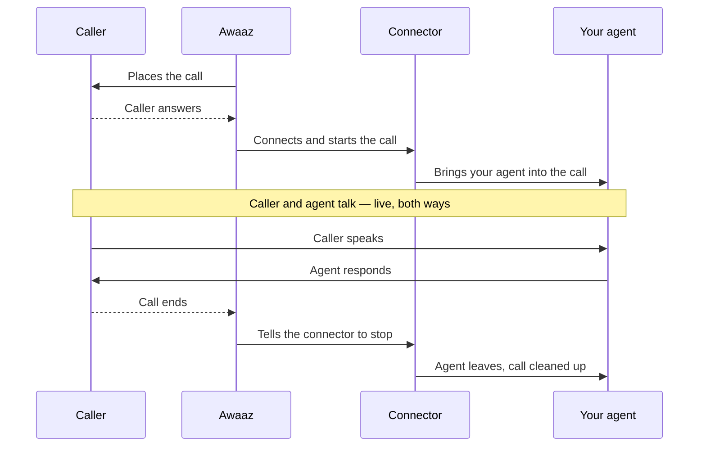

# Awaaz ⟷ LiveKit connector

Connect your **LiveKit voice agent** to real phone calls on the **Awaaz**
platform.

Awaaz runs the phone system and makes/receives the calls. You run a LiveKit
voice agent. This small service — the **connector** — sits between them: when a
call happens, Awaaz streams the live call audio to the connector over a
WebSocket, and the connector puts that audio into a LiveKit room where your agent
is waiting. Your agent talks back, and the connector sends that audio to the
caller.

**You do not need to know anything about telephony.** You run two things — this
connector and your LiveKit agent — and give Awaaz one URL.

```
   Awaaz                         YOU run this
 (the phone                ┌─────────────────────────────┐
  network)                 │                             │
   caller  ──── call ────► │  connector  ───►  LiveKit   │
                           │             ◄───   agent    │
                           └─────────────────────────────┘
        Awaaz streams the call audio to your connector over a WebSocket.
        The connector bridges it into a LiveKit room with your agent.
```

## What you do (the whole job)

1. Run the **connector** somewhere with a public address (so Awaaz can reach it).
2. Run your **LiveKit agent** (a normal LiveKit agent — sample agents included).
3. Give Awaaz the connector's **`wss://` URL**. Awaaz handles phone numbers,
   dialing, and call routing on their side.

That's it. Your agent code is a standard LiveKit agent — the connector requires
no changes to it.

## What you need

- **Python 3.10+** to run the connector (or Docker — image included).
- A **LiveKit Cloud project** ([cloud.livekit.io](https://cloud.livekit.io),
  free tier is fine). You'll need its URL, API key, and API secret.
- For the full sample voice agent: API keys for your speech/LLM providers
  (Deepgram, OpenAI, ElevenLabs by default — easily swapped).
- A way to expose the connector publicly: for testing, [ngrok](https://ngrok.com);
  for production, any server/cloud with a public HTTPS address.

## Repo layout

```
connector.py          the bridge (Awaaz WebSocket <-> LiveKit room)
requirements.txt      connector deps
.env.example          config template (copy to .env)
Dockerfile            connector container image
agents/               sample LiveKit agents you can run or copy from
  tone_agent.py         plays a test tone (no API keys) — quickest check
  echo_agent.py         echoes the caller back (no API keys)
  voice_agent.py        full talking agent (STT + LLM + TTS) + barge-in
  Dockerfile            agent image for LiveKit Cloud
  livekit.toml          LiveKit Cloud agent config template
  README.md             how to run/deploy the agents
```

---

# Call flow

How a single call works, end to end.



Each call is handled on its own, so many calls can run at the same time.

---

# Quick start (test it on your laptop in ~10 minutes)

This runs everything locally and uses ngrok to give Awaaz a temporary URL.

**1. Get the connector running**
```bash
python3 -m venv .venv && source .venv/bin/activate
pip install -r requirements.txt
cp .env.example .env
# edit .env: paste your LiveKit URL / API key / API secret
set -a && source .env && set +a
python connector.py
```

**2. Start a sample agent** (new terminal). The tone agent needs no API keys:
```bash
cd agents
python3 -m venv .venv && source .venv/bin/activate
pip install -r requirements.txt
set -a && source ../.env && set +a
python tone_agent.py dev
```

**3. Expose the connector** (new terminal):
```bash
ngrok http 8080
```
ngrok prints a URL like `https://abc123.ngrok-free.app`. The connector URL is the
same host with `wss://`: **`wss://abc123.ngrok-free.app`**.

**4. Give that `wss://` URL to Awaaz** and place a test call. You should hear a
steady tone — that confirms the whole path works. Then swap the tone agent for
`echo_agent.py` (speak, hear yourself) or `voice_agent.py` (a real conversation).
See [`agents/README.md`](agents/README.md).

---

# Going to production

When you're ready, one thing changes from the quick start: the connector needs a
**permanent** public address instead of ngrok.

## Set up LiveKit Cloud

1. Create a project at https://cloud.livekit.io and copy its URL/key/secret into
   the connector's `.env`.
2. Deploy the connector (below) with a public `wss://` URL; give it to Awaaz.
3. Run your agent — locally (recommended, see below) or on LiveKit Cloud using
   the included `agents/Dockerfile` + `agents/livekit.toml` (`lk agent create`,
   then `lk agent deploy`).

## Deploy the connector

The connector must be reachable from the internet so Awaaz can connect to it.

```bash
docker build -t awaaz-connector .
docker run -d --name connector -p 8080:8080 --env-file .env awaaz-connector
```

- Configure it via `.env`: `LIVEKIT_URL`, `LIVEKIT_API_KEY`,
  `LIVEKIT_API_SECRET`, and optionally `LIVEKIT_AGENT_NAME`.
- Put it behind **HTTPS/TLS** (a reverse proxy like nginx or Caddy, or your
  cloud load balancer) so Awaaz can reach it at `wss://connector.yourdomain.com`.
- Each call is independent, so you can run several instances behind a
  WebSocket-capable load balancer to scale.

## Recommendation: keep the agent close to the connector

Audio travels **caller → Awaaz → connector → LiveKit → agent → back**. The fewer
and shorter the network hops, the lower the delay the caller hears. So:

- **Run your agent next to the connector** (same host or same network/region),
  rather than far away.
- Choose the LiveKit Cloud region closest to your connector. Ask the Awaaz team
  which region their telephony runs in and deploy near it.

---

# For developers: the Awaaz audio protocol

You normally don't need this — the connector handles it. It's here for anyone
adapting the connector or porting from another platform.

Awaaz uses a JSON-over-WebSocket protocol very similar to **Twilio Media
Streams** (events `start` / `media` / `dtmf` / `mark` / `clear` / `stop`), with a
few differences:

| | Twilio Media Streams | Awaaz |
|---|---|---|
| Caller audio (incoming) | base64 **μ-law** 8 kHz | base64 **linear 16-bit PCM** 8 kHz |
| Playback audio (outgoing) | base64 μ-law | base64 **WAV** (44-byte header + 16-bit PCM 8 kHz) |
| JSON keys | camelCase (`streamSid`) | snake_case (`stream_sid`) |

> If you adapt Twilio code (e.g. Pipecat's serializer): don't μ-law-decode —
> Awaaz audio is linear PCM; and the audio you send back must be **WAV-wrapped**,
> not raw PCM.

Full spec: https://docs.awaaz.de/voice-hosting/websocket

## Barge-in (interruptions)

When the caller talks over the agent, the agent should tell the connector to
discard the audio it already queued. It does this by publishing a small message
on the LiveKit `audio_control` topic:

```python
# in your agent, when the user interrupts:
await ctx.room.local_participant.publish_data(
    b'{"event": "clear"}', topic="audio_control"
)
```

The included `voice_agent.py` already does this. Without it, conversation still
works — only interruptions won't cut off the agent cleanly.

## License

MIT — see [LICENSE](LICENSE).
